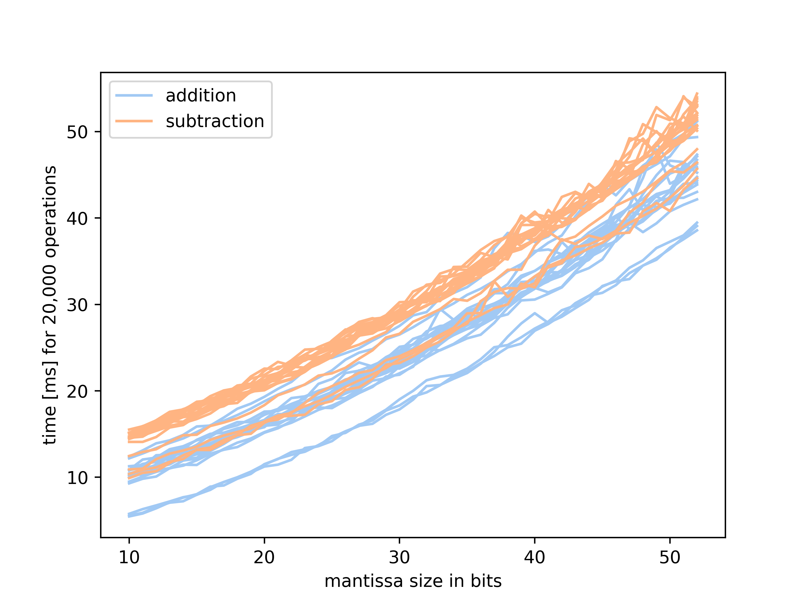

# mps

MPS (Multi Precision Simulator) is a tool designed to simulate multi-precision floating-point numbers while capturing differences in computation time. The core idea is to reimplement all binary floating-point operations at the bit level, using boolean values in C++. 

The code shown here represents the main implementations used in my Master’s thesis in Computational Science at the University of Vienna.

## Usage 

To build the project, run:

```
./run_build.sh
```

This script will:
 - Compiles `main.cpp` into the executable `run_main`
 - Build the C++ unit test binary `run_tests`
 - Generates `mps_lib.so`, which can be imported as a Python module

Once the build is complete, you can run the full test suite with:

```
./run_tests.sh
```

This will execute all tests, which are divided into:
 - $1,078$ tests for the C++ code
 - $17$ tests for the Python module

If all tests complete successfully, it is safe to either:
 - Run the compiled binary: `run_main`
 - Import the Python module in your code: `from mps_lib import mps`

### VS Code 

If you are using VS Code, you don’t need to run the run_build.sh script manually. Instead, you can use the built-in CMake Tools extension:

 - Open the Command Palette (`Ctrl + Shift + P`).
 - Run `CMake: Configure`.
 - Run `CMake: Build`.

## Results 

In this section, you will find two short excerpts from the results of my master’s thesis.

### Time Requirements for Different Mantissa Sizes

As shown in Figure 1, *addition* and *subtraction* show linear behavior, which is expected since the underlying algorithm has a complexity of $\mathcal{O}(n)$. *Subtraction*, however, requires slightly more time than *addition* since it involves computing the two’s complement of the subtrahend before performing the addition. This extra step — bitwise inversion followed by adding one — adds a small overhead, which explains the slightly higher execution time for subtraction compared to addition. *Multiplication* and *division* on the other hand show a more quadratic behavior, and have a noticeably higher time requirements than addition and subtraction. This is expected, since their algorithmic complexity is $\mathcal{O}(n^2)$.

On modern CPUs, *multiplication* is essentially as fast as *addition* and *subtraction*, and even division is only slightly slower. This is achieved through hardware-level optimizations such as pipelining, parallelism, and dedicated arithmetic units—optimizations that cannot be replicated efficiently in plain C++. These improvements, however, do not eliminate the underlying $\mathcal{O}(n^2)$ complexity; instead, they shift the cost from time to hardware resources (silicon area, power, and execution units). From a computational standpoint, it is therefore meaningful to measure the raw computational effort as provided by this framework, rather than relying solely on wall-clock timing.

<div style="display: flex; justify-content: space-between;" align="center"> 
    
    <br>
    <em>Figure 1: The time requirement for different mantissa sizes for addition and subtraction (left) and multiplication and division (right).</em>
</div>
